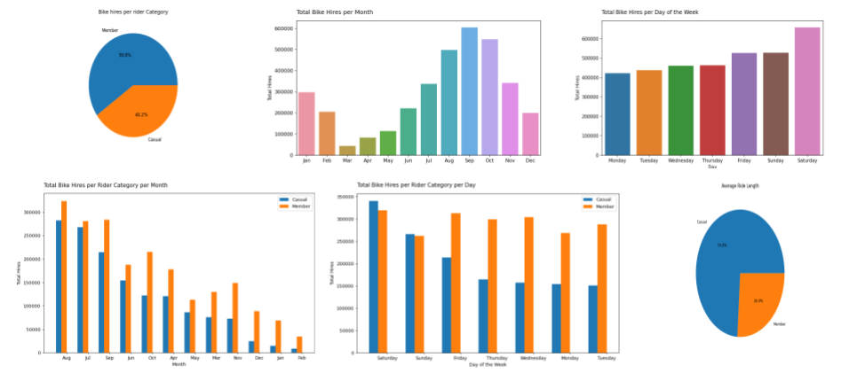

# cyclistic-bike-share
Data analysis of cyclistic bike share company

## **Case Study: Converting Casual Cyclistic Riders to Annual Members**

## Scenario 

As a junior data analyst working in the marketing analyst team at Cyclistic, a bike-share company in Chicago. The director of
marketing believes the company’s future success depends on maximizing the number of annual memberships. Therefore, my
team wants to understand how casual riders and annual members use Cyclistic bikes differently. From these insights, my team
will design a new marketing strategy to convert casual riders into annual members. But first, Cyclistic executives will review
my recommendations, so they must be backed up with compelling data insights and professional data visualizations.

## About the company 

In 2016, Cyclistic launched a successful bike-sharing offering. Since then, the program has grown to a fleet of **5,824** bicycles that are geotracked and locked into a network of **692** stations across Chicago. The bikes can be unloacked from one station and returned to any other station in the system anytime. 

Until now, Cyclistic’s marketing strategy relied on building general awareness and appealing to broad consumer segments. One approach that helped make these things possible was the flexibility of its pricing plans: single-ride passes, full-day passes, and annual memberships. Customers who purchase single-ride or full-day passes are referred to as casual riders. Customers who purchase annual memberships are Cyclistic members.

## Who are the Stakeholders ?

> 1. **Lily Moreno:** The director of marketing and my manager. Moreno is responsible for the development of campaigns and initiatives to promote the bike-share program. 
> 2. **Cyclistic marketing analytics team:** A team of data analysts who are responsible for collecting, analyzing, and reporting data that helps guide Cyclistic marketing strategy. 
> 3. **Cyclistic executive team:** A notoriously detail-oriented team which will decide whether to approve the recommended marketing program.

## The Problem Statement

The goal of this case study is to provide clear insights for designing marketing strategies aimed at converting casual riders into annual members. Towards this goal, I asked the following questions:

> 1. How do annual members and casual riders use Cyclistic bikes differently?
> 2. Why would casual riders buy Cyclistic annual memberships?
> 3. How can Cyclistic use digital media to influence casual riders to become members? 

## Ride share Data source

This case study uses Cyclistic's historical trip data (previous 12 months) to analyze and identify trends. The data has been made available by Motivate International Inc. under and open license. The data can be dowloaded [here.](https://divvy-tripdata.s3.amazonaws.com/index.html)

This data is reliable, original, comprehensive and current as it is internally collected and stored safely by Cyclistic from June 2020 to May 2021. Personally identifiable information  such as credit card numbers has been removed because of data-privacy issues.

The data selected for use covers the last 12 months from June 2020 to May 2021. Each month has a separate dataset. The datasets are organized in tabular format and have 13 identical columns. Combined, the datasets have 4073561 rows. The **member_casual** column will allow me to group, aggregate and compare trends between casual riders and member riders. 

## Processing the Data from Dirty to Clean

### Tools
To process the data from dirty to clean, I chose to use **python.** This is because python is relatively fast and thus useful in dealing with huge dasets. Python is also heavily supported by handy open-source libraries such as pandas and matplotlib. 

### Cleaning the data

After reading in and combining the 12 datasets into a single dataframe, the first step in data cleaning was to identify which columns and rows have missing data. I disvored that 6 out of 13 columns had missing data. Additionally, 314299 rows had missing values. 

Next, I indexed into into the first and last row with missing data and disovered that they had null values on multiple columns. I also computed the percentage of rows that had missing values. This stood at 7.71%. Upon examing the columns with missing data, I decided imputation would be a wrong approach because of the nature of the missing data. 

Since rows with missing values account for a tiny percentage of our data and appear to have missing values on multiple columns, I decided to remove them. 

After dropping rows with missing data, I checked if any of the remaining observations had duplicates. None of the rows were duplicated. After this step, I was confident the data was ready for further processing and analysis. 

### Transforming the data

Next, I checked the summary of the data and discovered that the **started_at** and **ended_at** columns were strings rather than datetime. As such, I converted the columns into datetime using the pandas **to_datetime()** function.

Next, I created the **ride_length** column by getting the difference between the ended_at and started_at columns. This yielded a timedelta object which I converted to seconds then minutes. 

Additionally, I created two more columns **day_of_week** and **month_name**. These contain the day of the week and month which a bike was hired respectively. 

Upon getting the summary to ensure data was ready for analysis, I discovered that there were negative integers on the ride length column. I therefore filtered the rows with negative ride length vlaues to examine them further. A closer examination revealed the negative values were a result of the ended_at day or time being smaller that the started_at. Only 10,237 rows exhibited this phenomena and thus were promptly filtered out. 

Finally, I got the summary of the data and concluded the data was ready for analysis. 

# Fun part : Data Analysis

In this step, I analyzed the cleaned data to find out how annual members and casual riders use Cyclistic bikes differently.

First, I got the total number of bike hired and established how they were shared between casual riders and  member riders. Next, I examined how total bike hires were distributed per month and then per day. This revealed some interesting trends that I shall discuss in the **share** stage. 

Next, I examined how bike hires between the two types of rider categories compared in a given month of the year and day of the week. The goal at this point was to find out whether casual riders had a preference for certain days or months compared with member riders. 

Next, I wanted to compare the difference in average ride length between casual riders and member riders. I discovered that casual riders tend to ride for longer periods of time compared to member riders. I was intrigued and decided to explore how the average ride length compares for both rider categories on daily and monthly basis. 

Finally I compared how the type of bike hired compared between the two rider categories. 

## Sharing Insights Through Visualization 

In this step, I created intuitive visualizations using seaborn and matplotlib python libraries to communicate the results of my analysis. 

The visualizations :

# Recommendations
- ## Educate the casual riders about the potential money saving by purchasing annual memberships as they ride longer
- ## Run marketing campaigns targeting casual riders during summer months
- ## Run weekend marketing campaigns targeting casual riders on digital platforms.

